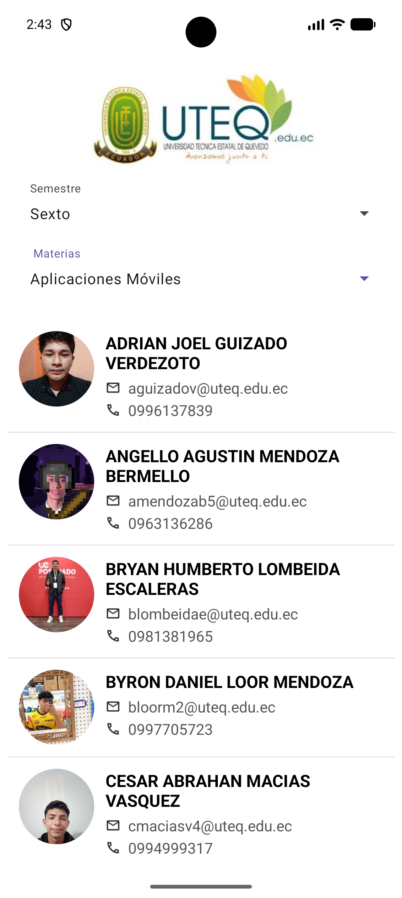

# Alumnos Supabase — Práctica de Contenedores UI

Aplicación nativa Android desarrollada en **Kotlin** que consulta información de alumnos almacenada en **Supabase** y la muestra en un **ListView** con diseño personalizado por elemento.

Repositorio de referencia: [ContenedoresUI_Supabase](https://github.com/cristianzambrano/ContenedoresUI_Supabase)

---

## Descripción de la actividad

El estudiante debe crear una aplicación Android que:

1. Se conecte a una base de datos **Supabase** mediante su SDK oficial.
2. Obtenga registros de la tabla `alumnos`.
3. Visualice los datos en un **ListView** con un **ArrayAdapter** personalizado.
4. Organice la interfaz con contenedores y componentes clásicos de Android.

### Interfaz de usuario

| Componente | Descripción |
|------------|-------------|
| `ImageView` | Logotipo institucional |
| `Spinner` | Selección de semestre |
| `Spinner` | Selección de materia |
| `ListView` | Lista de alumnos |

### Diseño del ítem (`item_alumno.xml`)

Cada registro muestra:

- Fotografía del alumno (carga dinámica con **Glide** + `circleCrop()`)
- Nombre completo
- Correo electrónico con icono
- Número telefónico con icono

---

## Tecnologías utilizadas

- **Kotlin**
- **Supabase SDK** (`postgrest-kt`) — consultas asíncronas con corrutinas
- **Glide** — carga de imágenes desde URL
- **Ktor Client Android** — motor HTTP del SDK
- **ListView** + **ArrayAdapter** personalizado
- **ConstraintLayout** y **LinearLayout**

### Restricciones cumplidas

Solo se utilizan: `ListView`, `ArrayAdapter`, Supabase SDK, Glide, `Spinner`, `ImageView`, `TextView`, `LinearLayout`, `RelativeLayout` y `ConstraintLayout`.

No se usa: RecyclerView, Jetpack Compose, Retrofit, Volley ni Firebase.

---

## Estructura del proyecto

```
app/src/main/java/com/example/practicaenclase/
├── MainActivity.kt              # Actividad principal y consultas a Supabase
├── Models/
│   ├── Alumno.kt                # Modelo de datos del alumno
│   └── Materia.kt               # Modelo para el filtro de materias
├── Adapters/
│   └── AlumnoAdapter.kt         # ArrayAdapter personalizado
├── Services/
│   └── SupabaseManager.kt       # Cliente Supabase centralizado
└── Utils/
    └── SupabaseErrorHandler.kt  # Manejo de errores REST
```

---

## Configuración e instalación

### Requisitos

- Android Studio (Ladybug o superior recomendado)
- JDK 11+
- Cuenta y proyecto en [Supabase](https://supabase.com)
- Tablas `alumnos` y `materias` en la base de datos

### Esquema esperado en Supabase

**Tabla `alumnos`:**

| Columna   | Tipo   |
|-----------|--------|
| id        | int    |
| nombres   | text   |
| correo    | text   |
| telefono  | text   |
| foto      | text   |

**Tabla `materias`:**

| Columna | Tipo |
|---------|------|
| id      | int  |
| nombre  | text |
| nivel   | int  |

### Credenciales (seguridad)

Las credenciales **no** están en el código fuente. Se definen en `local.properties`:

```properties
SUPABASE_URL=https://xxxxxxxx.supabase.co
SUPABASE_KEY=xxxxxxxxxxxxxxxxxxxxxxxx
```

Gradle las expone mediante `BuildConfig` en tiempo de compilación.

**Pasos:**

1. Clona el repositorio.
2. Copia `local.properties.example` a `local.properties` si no existe.
3. Agrega tu `SUPABASE_URL` y `SUPABASE_KEY` (clave `anon` / publishable).
4. Abre el proyecto en Android Studio.
5. Sincroniza Gradle y ejecuta en emulador o dispositivo físico.

---

## Flujo de la aplicación

1. El usuario selecciona un **semestre** en el primer `Spinner`.
2. La app consulta la tabla `materias` filtrando por `nivel` (1–7).
3. El segundo `Spinner` muestra las materias disponibles.
4. Al elegir una materia, se consulta la tabla `alumnos` ordenada alfabéticamente por `nombres`.
5. El `AlumnoAdapter` enlaza cada registro con `item_alumno.xml` y carga la foto con Glide.

---

## Capturas de pantalla



---

## Fragmentos de código relevantes

### Modelo `Alumno`

```kotlin
@Serializable
data class Alumno(
    val id: Int,
    val nombres: String,
    val correo: String,
    val telefono: String,
    val foto: String
)
```

### Consulta a Supabase (MainActivity)

```kotlin
val alumnos = SupabaseManager.client
    .from("alumnos")
    .select {
        order("nombres", Order.ASCENDING)
    }
    .decodeList<Alumno>()
```

### Adaptador personalizado

```kotlin
class AlumnoAdapter(
    context: Context,
    private val alumnos: ArrayList<Alumno>
) : ArrayAdapter<Alumno>(context, R.layout.item_alumno, alumnos)
```

---

## Compilación desde terminal

```bash
./gradlew assembleDebug
```

En Windows:

```bat
gradlew.bat assembleDebug
```

---

## Entrega académica

El documento PDF de entrega debe incluir:

- Código de la clase `Alumno`
- Código del `AlumnoAdapter`
- Código de la consulta a Supabase
- Capturas de la aplicación funcionando
- URL del repositorio en GitHub

---

## Autor

Práctica de desarrollo Android — Contenedores UI y Supabase SDK.
